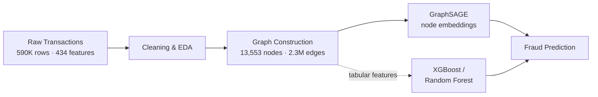

# 🔍 Fraud Detection with Graph Neural Networks

> Detecting fraudulent transactions by modeling account relationships as a graph — built with GraphSAGE on the IEEE-CIS dataset (590K real transactions).


## Table of Contents

- [Key Insight](#-key-insight)
- [How It Works](#-how-it-works)
- [Results](#-results)
- [Fraud Subgraph Visualization](#-fraud-subgraph-visualization)
- [Project Structure](#-project-structure)
- [Dataset](#-dataset)
- [Getting Started](#-getting-started)
- [Tech Stack](#-tech-stack)
- [Future Improvements](#-future-improvements)
- [Author](#-author)

---

## 💡 Key Insight

Fraudsters don't operate in isolation — they reuse the same email domains, billing addresses, and merchants across multiple stolen cards.

| | |
|---|---|
| **Tabular models** (XGBoost, Random Forest) | see each transaction in isolation |
| **Graph Neural Networks** | see the entire network, and catch fraud rings that flat models miss |

By representing accounts, devices, and merchants as a connected graph instead of independent rows, a GNN can pick up on relational fraud signals that simply don't exist in a tabular feature vector.

---

## 🏗️ How It Works



**Graph construction.** Transactions are converted into a graph where:
- **Nodes** represent customer accounts
- **Edges** connect accounts that share behavioral signals — email domains, merchants, or transaction patterns

The resulting graph has **13,553 nodes** and **2.3 million edges**, which lets GraphSAGE learn from each account's neighborhood rather than treating every transaction as independent.

---

## 📊 Results

| Model | Fraud Recall | Fraud Precision | Fraud F1 | AUC-ROC |
|---|---|---|---|---|
| **GraphSAGE GNN** | **0.70** | 0.54 | **0.61** | 0.89 |
| XGBoost | 0.58 | 0.28 | 0.38 | 0.89 |
| Random Forest | 0.47 | 0.91 | 0.62 | 0.94 |

**Takeaway:** the GNN catches roughly 49% more fraudulent transactions than Random Forest by modeling account–merchant relationships, while matching XGBoost's AUC at a ~93% improvement in fraud precision — meaning far fewer false-positive investigations for the same detection power.

Random Forest still wins on raw AUC and precision, but at the cost of missing nearly half of all fraud cases (recall of 0.47) — a tradeoff that matters more in some fraud-ops contexts than others.


---

## 🕸️ Fraud Subgraph Visualization


*Red nodes = fraudulent accounts, blue nodes = legitimate accounts. Fraud nodes visibly cluster together — this is the structural signal GraphSAGE learns to exploit.*

---

## 📁 Project Structure

| Notebook | Description |
|---|---|
| [`01_data_loading.ipynb`](01_data_loading.ipynb) | Load and clean 590K IEEE-CIS transactions, exploratory data analysis |
| [`02_graph_construction.ipynb`](02_graph_construction.ipynb) | Build the account graph (13,553 nodes, 2.3M edges) |
| [`03_gnn_model.ipynb`](03_gnn_model.ipynb) | Train GraphSAGE for node-level fraud classification |
| [`04_baselines.ipynb`](04_baselines.ipynb) | XGBoost and Random Forest baseline comparison |

---

## 📦 Dataset

**[IEEE-CIS Fraud Detection](https://www.kaggle.com/c/ieee-fraud-detection)** — Kaggle, provided by Vesta Corporation

- 590,540 real online transactions
- 3.5% fraud rate (highly imbalanced)
- 434 raw features, reduced to 10 engineered graph-relevant features

---

## 🚀 Getting Started

1. **Clone the repo**
   ```bash
   git clone https://github.com/sruthi-kurra/fraud-detection-gnn.git
   ```
2. **Get the data** — download `ieee-fraud-detection.zip` from [Kaggle](https://www.kaggle.com/c/ieee-fraud-detection) (requires a free Kaggle account)
3. **Open the notebooks in order**, either locally in Jupyter or in [Google Colab](https://colab.research.google.com/):
   - `01_data_loading.ipynb` → `02_graph_construction.ipynb` → `03_gnn_model.ipynb` → `04_baselines.ipynb`
4. **Upload the dataset** when prompted in the first notebook
5. **Run all cells top to bottom**

> 💡 The graph construction and GNN training steps are the most memory-intensive — a GPU runtime (e.g. Colab's free tier) is recommended for `03_gnn_model.ipynb`.

---

## 🛠️ Tech Stack

`Python` · `PyTorch Geometric` · `XGBoost` · `scikit-learn` · `NetworkX` · `pandas` · `matplotlib`

---

## 🔮 Future Improvements

- [ ] Swap GraphSAGE for a heterogeneous GNN (e.g. HGT or HAN) to model account, device, and merchant nodes as distinct types instead of collapsing them into one graph
- [ ] Add edge features (transaction amount, time delta) instead of relying solely on shared-attribute edges
- [ ] Tune the classification threshold per-model to directly compare precision/recall at matched operating points
- [ ] Package the trained GraphSAGE model behind a simple inference script for scoring new transactions

---

## ✍️ Author

**[Sruthi Kurra](https://github.com/sruthi-kurra)**

If you find this useful or have ideas for improving it, issues and pull requests are welcome.


